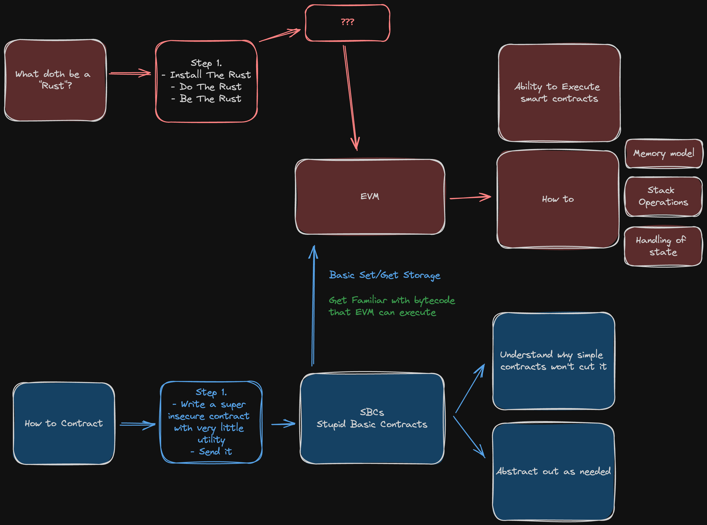

# rust-evm-simulator
Please do not use this, I have no idea what I'm doing. Thank you.

# The cannot fail learning path

This will be incredibly easy and I have all the faith that I can do this effectively.

# Thing To Start 🤯
## Solidity Contract Basics

## Understanding EVM Basics

## Setting Up Rust Environment

## Rust implementation of EVM Core

## Handling Solidity Contracts

## Extending EVM Functionality

## Testing and Validation

# Things To Understand 🧠

# Things Done Poorly ✅

# FAQTIAM

- **What does FAQTIAM mean?**
    - Frequently asked questions that I ask myself
- **Who is this for?**
    - Me.
- **Why did you create this project?**
    - I thought to myself "That would be cool" and here we are
- **Why make it public?**
    - There's no "private" in "public shaming for not committing enough to personal projects will hopefully motivate me"
- **Will this work?**
    - I really really doubt it
